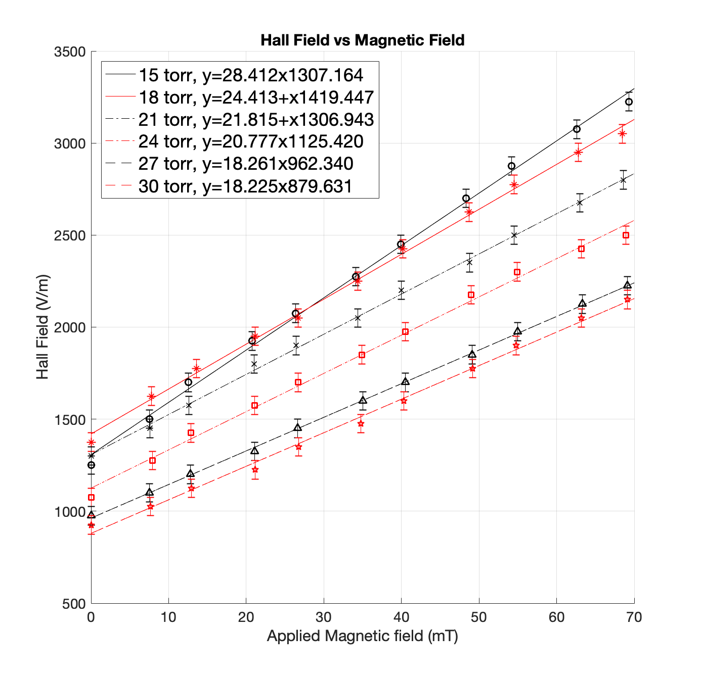
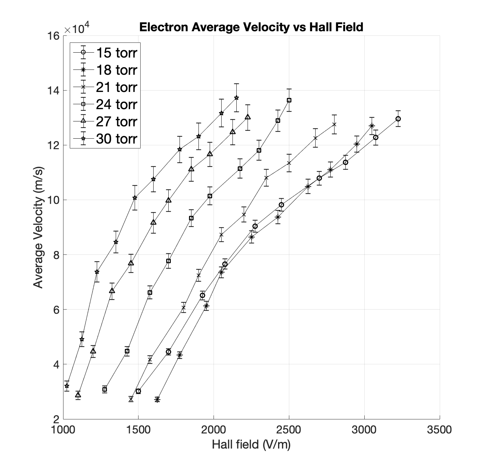
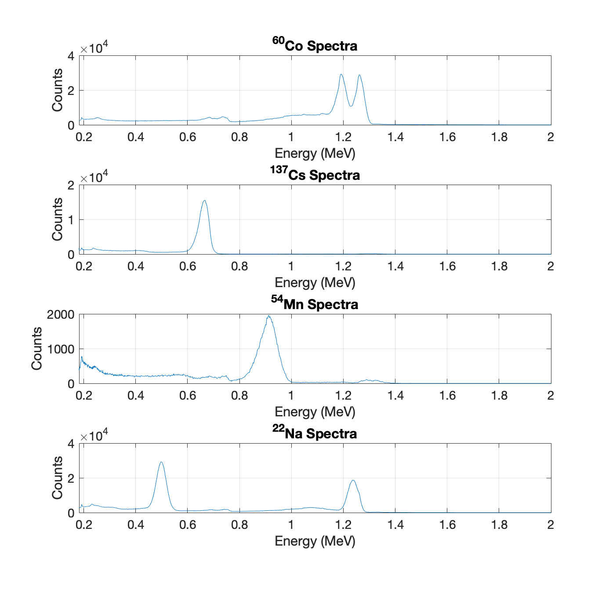
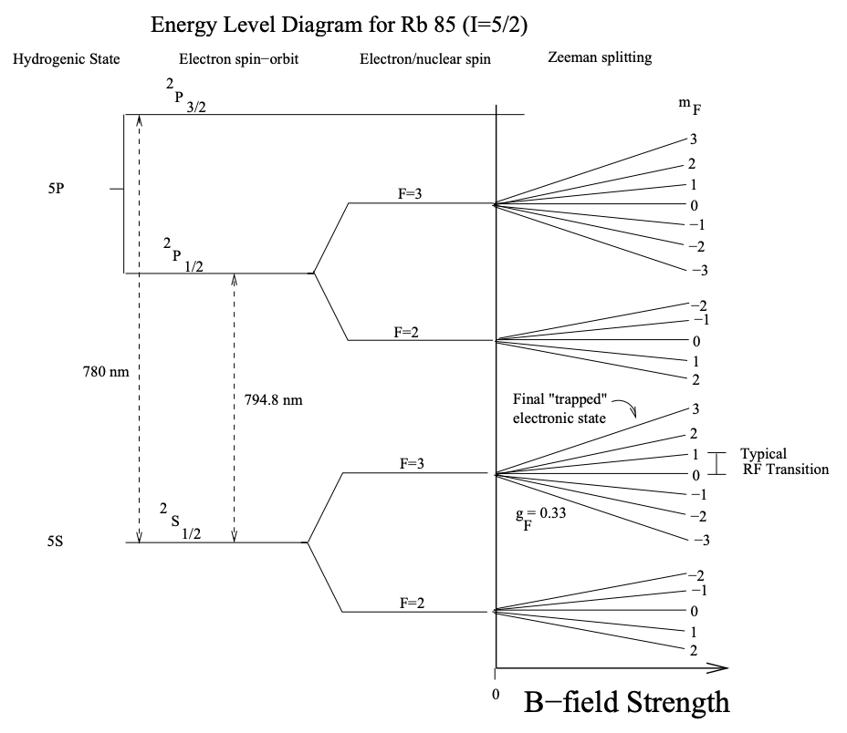
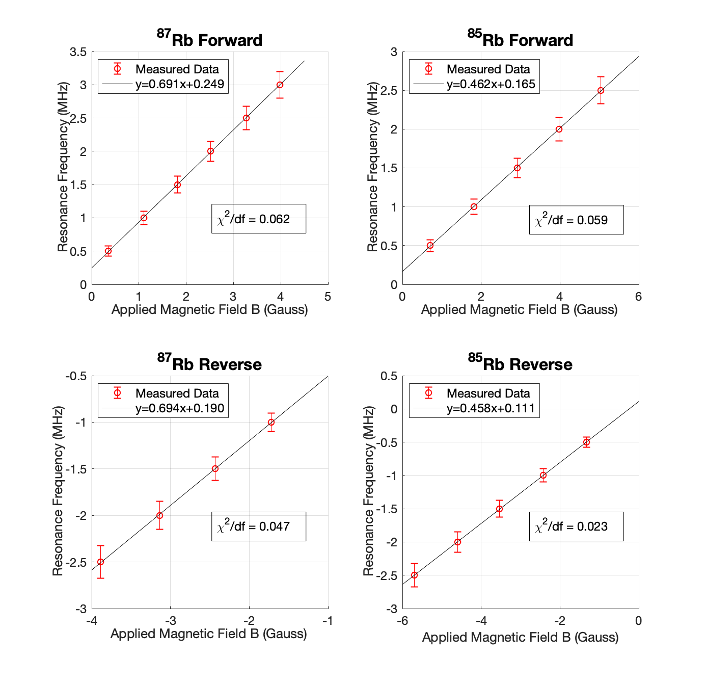
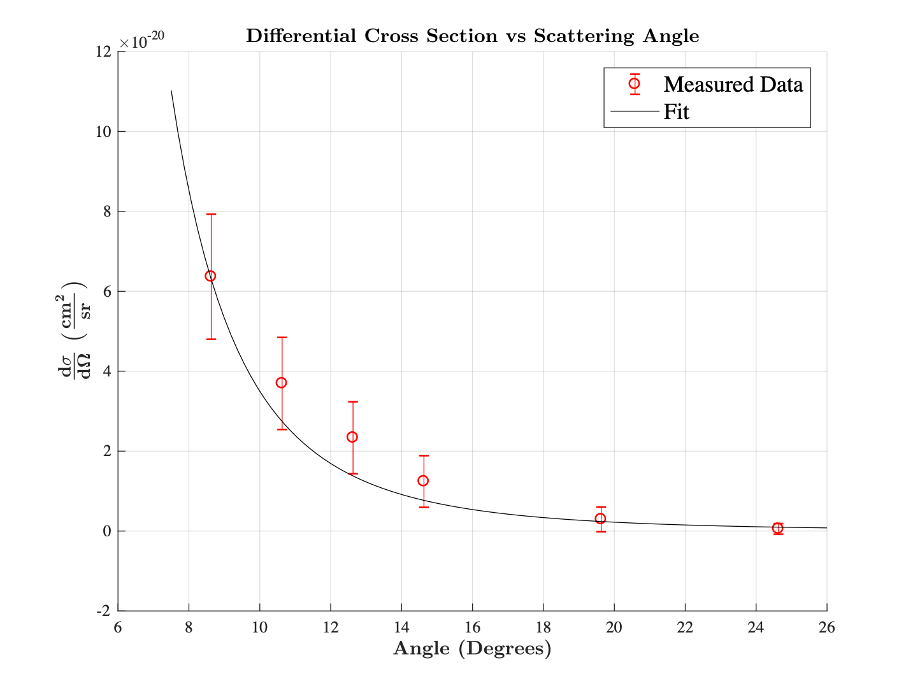
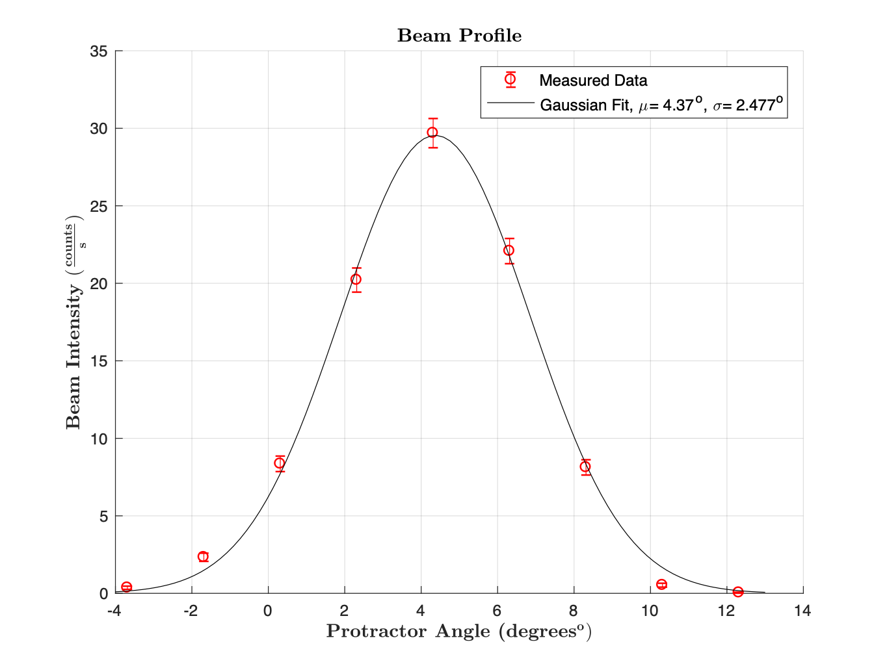

# Physics Experiments and MATLAB scripts

This repo contains comprehensive data analyses of 4 physics experiments that I did at UC Berkeley. Raw experimental data, MATLAB scripts I wrote to analyze the data, and write-ups can be found for all four experiments in this repo. 

Below is a short summary on the experiments that were done and some of the data that was obtained and analyzed. (All data analyses was done using MATLAB)

## Hall Effect in a Plasma

Summary: In this experiment, the Hall Effect is observed in a low-density plasma contained in a discharge tube. Because the density of conduction electrons ne in most laboratory plasmas are many orders of magnitude smaller than in metals, the Hall effect in a plasma is much larger and more easily observable than in metals, and thus a quantitative examination of plasma properties is easily obtained. First, the relationship between the discharge voltage and discharge current for a variety of pressures will be determined. Next, a small hysteresis effect is shown to be present through the magnet used in the experiment. The relationship between the Hall field and the applied magnetic field for a variety of pressures will also be determined. From these measurements, the drift velocity, density, collision frequency, average thermal velocity, temperature of the electron gas will be calculated.

Some of the data that was collected for this experient and its analysis is shown below: 

 

* (LEFT) Hall Field EH as a function of applied magnetic field B for six different pressures. A linear relationship exists and is expected by Eq. (5). Another general trend that can be seen is at a given magnetic field, the Hall field is lower at higher pressures. This can be seen as the result of the increase in free electrons produced with higher pressures, resulting in lower Hall fields by Eq. (5). Error bars associated with reading errors were approximately ±50V. The reduced chi-squared value χ2 for the linear fits were 0.45, 0.30, 0.14, 0.44, 0.04, df and 0.30 for 15 torr, 18 torr, 21 torr, 24 torr, 27 torr, and 30 torr respectively.

* (RIGHT) Average Thermal Velocity <|v|>e of Electrons as a function of Hall field EH. Average velocity increases with Hall field and at higher pressures (with constant Hall field), as expected by an increase in collision frequency.

The full write-up and more detailed analysis of this experiment can be found [here](https://github.com/brandonktran/Physics_Experiments_and_MATLAB_scripts/blob/master/Hall_Effect_Plasma/HAL_writeup.pdf).

## Gamma Ray Spectroscopy

Summary: In this experiment, the gamma ray spectra of four radioactive sources, i.e., 60Co, 137Cs, 22Na, and 54Mn will be collected using a NaI scintillation detector, a photomultiplier tube (PMT), an external amplifier, and a pulse height analyzer (PHA). First, the capabilities of the equipment, including the linearity of the amplifier and the gain of the photomultiplier tube, will be determined to provide the best possible calibration settings to collect the gamma ray spectra. The spectras will be analyzed to determine the backscatter peaks, Compton edges, and photopeaks of each source.. By varying the source distance from the detector, the absolute intensity of 137Cs and the inverse square law will also be determined. Lastly, the mass attenuation coefficients of Al, Cu, and Pb will be calculated from the 137Cs and 22Na sources.

Some of the data that was collected for this experient and its analysis is shown below: 

 

* (LEFT) Energy Spectrum of 60Co, 137Cs, 22Na, and 54Mn. The energy axis was calibrated using known photopeak energy values. The photopeaks, backscatter peaks, and Compton edges can be seen in each spectrum.

* (RIGHT) Semilog plot in the y-axis of Intensity vs absorber thickness for each absorber. The linear attenuation coefficients of Cu, Al, and Pb were obtained for a 137Cs source using a straight line fit

The full write-up and more detailed analysis of this experiment can be found [here](https://github.com/brandonktran/Physics_Experiments_and_MATLAB_scripts/blob/master/Gamma_Ray_Spectroscopy/GMA_writeup.pdf).

## Optical Pumping

Summary: In this experiment, 85Rb and 87Rb atoms were optically pumped to higher energy levels. Incorporating the Zeeman effect using a modulating magnetic field and a radiofrequency (RF) field, these atoms were continuously pumped and ”de-pumped.” Measurements of the resonance frequency and magnetic field values allowed a calculation of the Zeeman energy levels of these atoms. Using the Breit-Rabi equation, the nuclear spins of 87Rb and 85Rb were determined to be 1.520 ± 0.017 and 2.542 ± 0.032, respectively. The magnitude of Earth’s magnetic field at the location of Berkeley’s Physics 111 Laboratory was also calculated to be 0.314 Gauss ± 0.029 Gauss from the data.

Some of the data that was collected for this experient and its analysis is shown below: 

 

* (LEFT) Energy levels and splittings in 85Rb.

* (RIGHT) Resonant RF frequencies as a function of the applied Helmholtz magnetic field BH for 85Rb and 87Rb.

The full write-up and more detailed analysis of this experiment can be found [here](https://github.com/brandonktran/Physics_Experiments_and_MATLAB_scripts/blob/master/Optical_Pumping/OPT_writeup.pdf).

## Rutherford Scattering

Scattering of alpha-particles off gold foil

Verify the angular dependence of the Rutherford scattering formula

Calculate the atomic number of gold

Some of the data that was collected for this experient and its analysis is shown below: 

 

* (LEFT) Beam profile of Am241 source.

* (RIGHT) Differential Cross Section vs Scattering Angle.

The presentation of the results and more detailed analysis of this experiment can be found [here](https://github.com/brandonktran/Physics_Experiments_and_MATLAB_scripts/blob/master/Rutherford_Scattering/RutherfordScattering_presentation.pptx).
