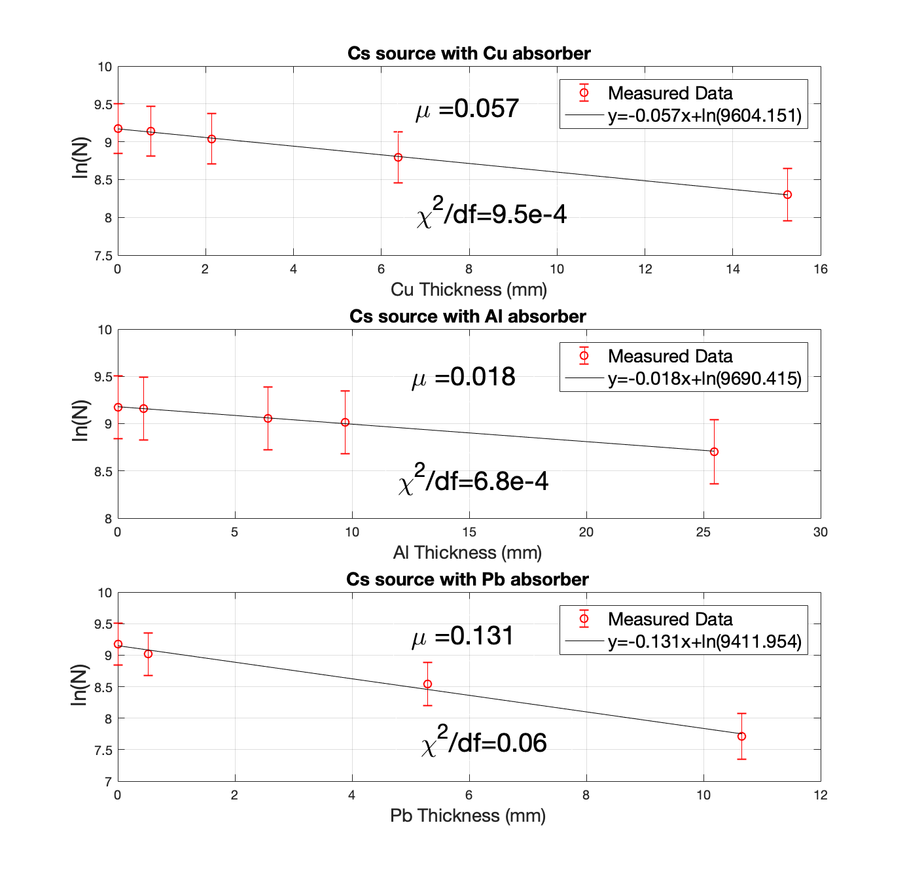

# Physics Experiments and MATLAB scripts

This repo contains comprehensive data analyses of 4 physics experiments that I did at UC Berkeley. Raw experimental data, MATLAB scripts I wrote to analyze the data, and write-ups can be found for all four experiments in this repo.

## Hall Effect in a Plasma

 

* (LEFT) Hall Field EH as a function of applied magnetic field B for six different pressures. A linear relationship exists and is expected by Eq. (5). Another general trend that can be seen is at a given magnetic field, the Hall field is lower at higher pressures. This can be seen as the result of the increase in free electrons produced with higher pressures, resulting in lower Hall fields by Eq. (5). Error bars associated with reading errors were approximately ±50V. The reduced chi-squared value χ2 for the linear fits were 0.45, 0.30, 0.14, 0.44, 0.04, df and 0.30 for 15 torr, 18 torr, 21 torr, 24 torr, 27 torr, and 30 torr respectively.

* (RIGHT) Average Thermal Velocity <|v|>e of Electrons as a function of Hall field EH. Average velocity increases with Hall field and at higher pressures (with constant Hall field), as expected by an increase in collision frequency.

## Gamma Ray Spectroscopy

 

* (LEFT) Energy Spectrum of 60Co, 137Cs, 22Na, and 54Mn. The energy axis was calibrated using known photopeak energy values. The photopeaks, backscatter peaks, and Compton edges can be seen in each spectrum.

* (RIGHT) Semilog plot in the y-axis of Intensity vs absorber thickness for each absorber. The linear attenuation coefficients of Cu, Al, and Pb were obtained for a 137Cs source using a straight line fit

## Optical Pumping

 

* (LEFT) Energy levels and splittings in 85Rb.

* (RIGHT) Resonant RF frequencies as a function of the applied Helmholtz magnetic field BH for 85Rb and 87Rb.

## Rutherford Scattering

 

* (LEFT) Beam profile of Am241 source.

* (RIGHT) Differential Cross Section vs Scattering Angle.
